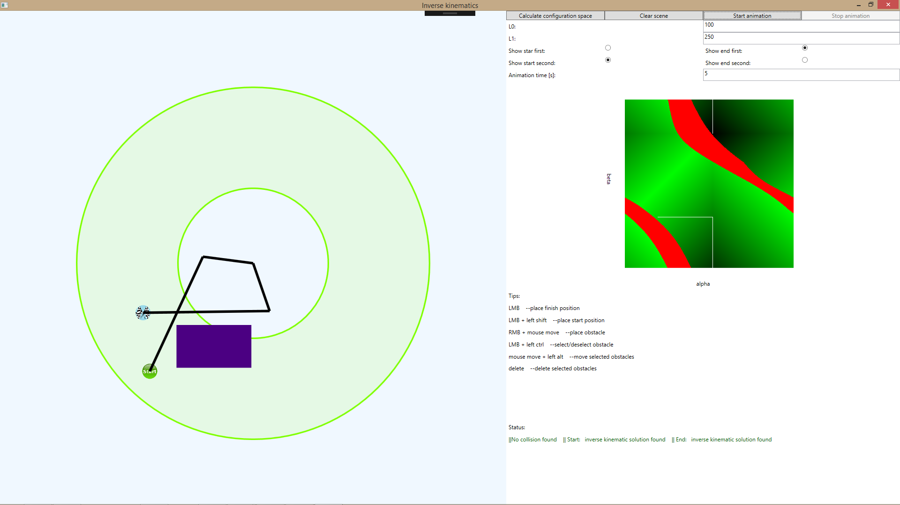

# ReverseKinematic

Celem aplikacji jest poszukiwanie drogi dla dwuwymiarowego łańcucha kinematycznego. 
Aplikacja umożliwia wybranie punktu startowego i końcowego, dodawanie przeszkód oraz modyfikacje wymiarów członów manipulatora. 

W celu wyznaczenia drogi po której będzie się poruszał robot konieczne jest rozwiązanie zadania odwrotnego kinematyki dla pozycji początkowej i końcowej.
W przypadku kiedy rozwiązanie danego położenia posiada dwa warianty użytkownik ma możliwość wyboru innego niż domyślne rozwiązanie.
Program wyznacza ścieżkę w przestrzeni konfiguracji, wyrażoną w postaci kątów wewnętrznych. 
Następnie odbywa się ruch po obliczonej trajektorii, który można obserwować jako ruch członów manipulatora. 

W programie uwzględniona została możliwość dodawania przeszkód ograniczających ruch mechanizmy szeregowego.

Podczas animacji blokowana jest możliwości modyfikacji parametrów robota, ramie porusza się od pozycji startowej do końcowej.

Wyznaczenie ścieżki uwzględniającej omijanie przeszkód wizualizowane jest również w przestrzeni konfiguracji.

W celu szybkiej modyfikacji sceny, program wspiera czyszczenie wszystkich przeszkód ze sceny,
jak również kasowanie czy przesuwanie tylko zaznaczonych obiektów.

W przypadku wybrania pozycji startowej lub końcowej poza obszarem roboczym manipulatora,
użytkownikowi wyświetlana jest informacja o zaistniałej sytuacji.

W przypadku zadania nieposiadającego rozwiązania, użytkownik jest informowany poprzez wypisany status zadania.

Przykład sceny w której wybrany wariant rozwiązania startowego nie posiada rozwiązania widoczny jest na poniższych dwóch obrazkach. 

Ta sama konfiguracja sceny co na powyższym obrazku z wybranym alternatywnym wariancie ustawienia manipulatora.
Wariant drugi jest bezkolizyjny tzn. można uruchomić w nim symulacje ruchu.

